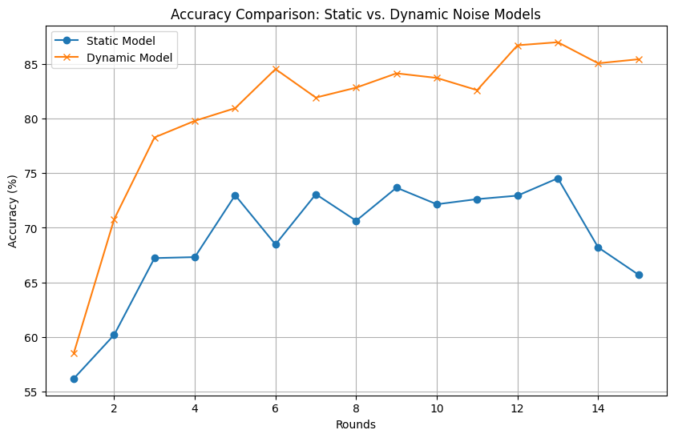

Adaptive Differential Privacy Project
=====================================

--------------------------------------------------------------
1. Project Description
--------------------------------------------------------------

This project explores the concept of Adaptive Differential Privacy using federated learning. It includes two models:
1. Static Noise Model: Applies a fixed noise level for privacy preservation.
2. Dynamic Noise Model: Implements dynamic noise adjustment based on gradient analysis.

Both models use federated learning on the MNIST dataset, distributed across multiple clients, with a focus on secure and privacy-preserving training.

--------------------------------------------------------------
2. Project Purpose
--------------------------------------------------------------

The primary goal of this project is to demonstrate the impact of Adaptive Differential Privacy in federated learning settings. By comparing static and dynamic noise approaches, this work aims to highlight the trade-offs between model accuracy and privacy budgets (ε). This project provides insights into how gradient norms can be effectively used to scale noise dynamically for better privacy-utility trade-offs.

--------------------------------------------------------------
3. Directory Structure
--------------------------------------------------------------


--------------------------------------------------------------
4. Instructions to Run the Project
--------------------------------------------------------------

### Prerequisites
1. Python 3.11 or later.
2. Dependencies specified in `requirements.txt`.

### Setup
1. Open a Command Line Interface (CLI) and navigate to the project directory:

```
cd Adaptive Differential Privacy
```
2. Install Python dependencies:

```
pip install -r requirements.txt
```


### Dataset
Ensure the MNIST dataset is located in the following directory:
```
/Adaptive Differential Privacy/dataset/MNIST/
```
Download the data from this link: https://www.kaggle.com/datasets/hojjatk/mnist-dataset

After unzipping it, copy only:
```
train-images.idx3-ubyte, train-labels.idx1-ubyte, t10k-images.idx3-ubyte, t10k-labels.idx1-ubyte
```
to `/Adaptive Differential Privacy/dataset/MNIST/`

### Running the Static Noise Model
1. Navigate to the `static noise` directory:
```
cd static noise
```
2. Start the server:
```
python server.py
```
3. In a separate Command Line Interface window, launch clients:
```
python launch_clients.py
```

### Running the Dynamic Noise Model
1. Navigate to the `dynamic noise` directory:
```
cd dynamic noise
```
2. Start the server:
```
python server.py
```
3. In a separate Command Line Interface window, launch clients:
```
python launch_clients.py
```

--------------------------------------------------------------
5. Key Implementation Details
--------------------------------------------------------------

- Static Noise Model:
  - Uses a fixed noise multiplier throughout training.
  - Suitable for environments with predefined privacy budgets.

- Dynamic Noise Model:
  - Adjusts noise levels dynamically based on gradient analysis.
  - Enhances the trade-off between privacy and model utility.

- Server:
  - Manages the global model and aggregates weights from clients.
  - Implements a custom FedAvg strategy for model aggregation.
  - Saves global models in the respective `global_models/` directory.

- Client:
  - Processes local training using the MNIST dataset.
  - Reports training metrics and model updates to the server.

- Libraries and Techniques
  - PyTorch: Core framework for deep learning and model training.
  - Flower Framework: For federated learning simulation.
  - Differential Privacy: Implemented by scaling noise to gradients during local training.

--------------------------------------------------------------
6. Results and Metrics
--------------------------------------------------------------

- Static Noise Model:
  - Server-side evaluation metrics (loss and accuracy and privacy budget) are saved in:
  ```
  /Adaptive Differential Privacy/static noise/metrics evaluation/evaluation_metrics_server.txt
  ```

- Dynamic Noise Model:
  - Server-side evaluation metrics (loss and accuracy and privacy budget) are saved in:
  ```
  /Adaptive Differential Privacy/dynamic noise/metrics evaluation/evaluation_metrics_server.txt
  ```


  # Comparative Results: Static vs. Dynamic Noise Models

| Round | Static Model Loss | Static Model Accuracy (%) | Dynamic Model Loss | Dynamic Model Accuracy (%) | Static ε | Dynamic ε |
|-------|--------------------|---------------------------|--------------------|----------------------------|----------|-----------|
| 1     | 1.2300            | 56.19                    | 1.4140            | 58.53                     | 0.21     | 0.20      |
| 5     | 1.0958            | 72.98                    | 0.5437            | 80.95                     | 1.58     | 1.55      |
| 10    | 1.3639            | 72.15                    | 0.4516            | 83.72                     | 4.12     | 4.03      |
| 15    | 2.0515            | 65.70                    | 0.4106            | 85.43                     | 7.34     | 7.18      |

  ## Graphical Analysis
  
### Accuracy Comparison: Static vs. Dynamic Noise Models


### Loss Comparison: Static vs. Dynamic Noise Models


### Privacy Budget (ε) Comparison: Static vs. Dynamic Noise Models


--------------------------------------------------------------
7. Interpretation of Results
--------------------------------------------------------------

- The Dynamic Noise Model consistently achieves better accuracy compared to the Static Noise Model due to its ability to adapt noise levels based on gradient sensitivity.

- The Loss in the Dynamic Noise Model is significantly lower across rounds, reflecting improved training stability and model performance.

- The Privacy Budget (ε) for the Dynamic Noise Model remains competitive with the Static Noise Model, demonstrating its ability to balance privacy and utility effectively.

--------------------------------------------------------------
8. Conclusion
--------------------------------------------------------------

This project demonstrates the potential of Adaptive Differential Privacy in federated learning. By leveraging gradient sensitivity to dynamically adjust noise levels, the Dynamic Noise Model achieves a superior balance between privacy and model utility compared to the Static Noise Model. The results validate the importance of dynamic noise scaling in enhancing federated learning frameworks while maintaining robust privacy guarantees.

Future work could explore:

- Extending the approach to more complex datasets and models.
- Investigating other privacy-preserving mechanisms in conjunction with Adaptive Differential Privacy.
- Optimizing the dynamic noise scaling mechanism for even better trade-offs.

This project serves as a foundational study in the field of privacy-preserving machine learning and offers practical insights for future research and development.
